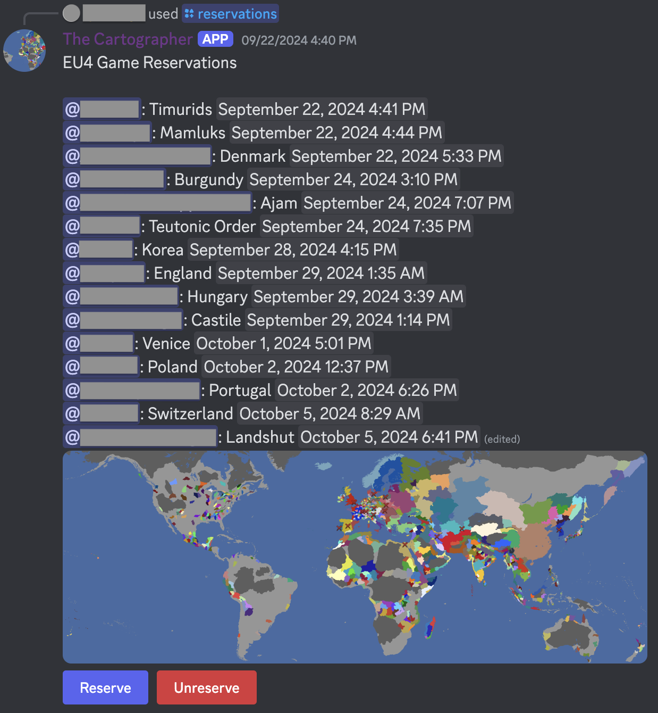

# The Cartographer

The Cartographer is a Discord Bot and [website](https://2kai2kai2.github.io/cartographer/) for multiplayer [EU4](https://store.steampowered.com/app/236850/Europa_Universalis_IV/) communities to manage game reservations and generate beautiful game after-session reports.

## Game Reservations - Discord Bot

The Cartographer Discord bot provides game reservation functionality, allowing players to pick their nations to play as.

This includes:
- Order and dates that players made their reservations
- Map of reserved tags (to help find an available one)

Click [here](https://discord.com/oauth2/authorize?client_id=649443792495050763) to add **The Cartographer** to your Discord server

## Stats - Website

The Cartographer website produces game stats/post-session report images that can be posted to your Discord community.

This includes:
- Basic info about player nations including army size, navy size, total development, and net income (player names are hidden in the image below)
- Top four most significant player wars (based on number of players on either side and number of casualties)
- Map with borders highlighting player nations (including subject states)
- Modify the player list before generating (since EU4 tends to be inconsistent in correctly saving this)

Click [here](https://2kai2kai2.github.io/cartographer/) for the website.

## Issues

If you have any issues, [join the Discord server](https://discord.gg/yQWUAxMsZf) or [open an issue on GitHub](https://github.com/2kai2kai2/cartographer/issues)
